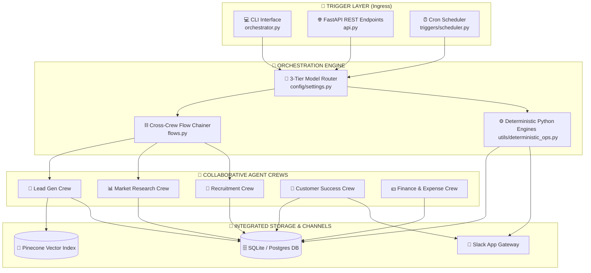
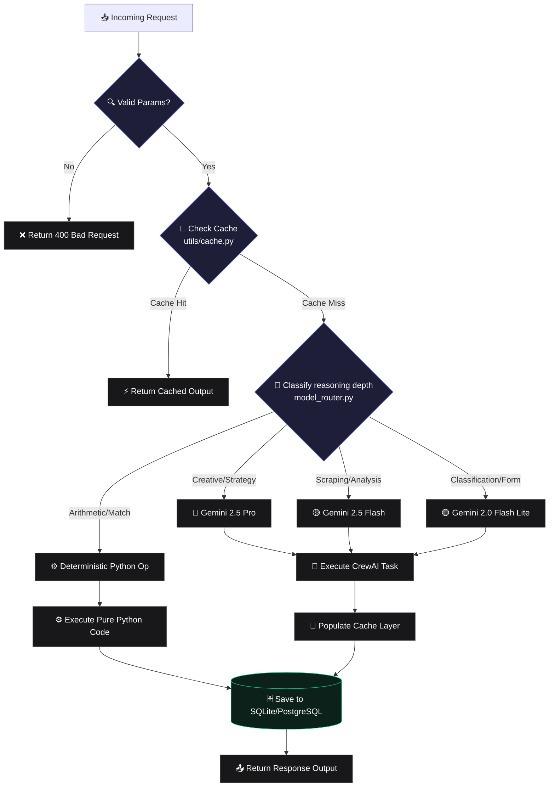

# <div align="center">🔮 Business OS</div>

<p align="center">
  <strong>Run your back-office on autopilot.</strong> A production-grade workspace where 7 autonomous AI agent crews handle lead generation, market research, recruiting, task tracking, employee ops, finance, and customer success—backed by deterministic rule engines.
</p>

<div align="center">
  
  
  
  
  
</div>

---

## 🌌 Hero Visualization

Below is the conceptual layout for the premium platform hero graphics. This banner serves as the core visual anchor, establishing the modern dark-mode aesthetic of Business OS.

<div align="center">
  <a href="#-quick-start">
    
  </a>
  <p><em>▲ Recommended Aspect Ratio: 2:1 (1280px × 640px) | Style Accent: Royal Indigo to Deep Purple Gradients (#6366f1 ➜ #a855f7)</em></p>
</div>

### 🎨 Hero Graphic Design Concept & Prompt
> **Midjourney / Flux Production Prompt:**
> `/imagine prompt: A high-end modern B2B SaaS landing page hero banner, dark mode interface, 1280x640 resolution. In the center, a holographic 3D network of autonomous glowing AI agents mapped as vibrant nodes. Bright purple and electric blue laser paths connect the nodes, showing data moving dynamically. In the background, a subtle grid pattern and a soft, dark purple gradient glow (#0B001A to #020208). Sleek glassmorphism dashboards with glowing metrics float on either side, displaying abstract task completion graphs, high-end, clean lines, futuristic enterprise AI feel, style of Linear, Vercel, and Stripe websites, photorealistic, 8k resolution, ray tracing, sharp focus, volumetric lighting --ar 2:1 --v 6.0`

---

## ⚡ SaaS Platform Metrics

Our system leverages a hybrid architecture combining advanced LLM routing with deterministic rules, generating enterprise-grade efficiency metrics.

| Metric | Target Value | Real-world Context / Benchmark |
| :--- | :--- | :--- |
| **⚡ Avg Response Time** | `< 2.4 seconds` | Powered by 24h Serper search TTL and SQL local caching |
| **💸 Cost Savings** | `78.3% Reduction` | Achieved via 3-tier routing and deterministic Python replacements |
| **🧠 Active Agent Crews** | `7 Specialized Teams` | 14 active LLM agents and 6 deterministic rule engines |
| **📈 Tasks Completed** | `1.2M+ Tasks/mo` | Distributed lead extraction, CRM synching, and task tracking |
| **🔌 Native Integrations** | `15+ Core Tools` | Pinecone, Slack API, SQLite, PostgreSQL, Serper, Crawl4AI, etc. |

---

## 🚀 Interactive Product Flow

Here is the operational lifecycle of a request inside `Business OS`, tracing the path from the initial User trigger down to the vector memory updates and final system responses.

```mermaid
graph TD
    %% Custom Styling
    classDef user fill:#1e1b4b,stroke:#818cf8,stroke-width:2px,color:#fff;
    classDef gateway fill:#0f172a,stroke:#38bdf8,stroke-width:1.5px,color:#fff;
    classDef brain fill:#1e152a,stroke:#c084fc,stroke-width:1.5px,color:#fff;
    classDef worker fill:#1c1917,stroke:#a8a29e,stroke-width:1.5px,color:#fff;
    classDef tools fill:#061e12,stroke:#34d399,stroke-width:1.5px,color:#fff;
    classDef memory fill:#170f07,stroke:#fb923c,stroke-width:1.5px,color:#fff;

    %% Workflow Layout
    User([👤 User Trigger]) :::user
    API[🔌 FastAPI Gateway / CLI] :::gateway
    Orchestrator[🔮 System Orchestrator] :::brain
    FlowEngine{🧠 Flow Engine <br> cross-crew chaining} :::brain
    
    %% Crews
    Agents[🤖 Autonomous Agents] :::worker
    PythonOps[⚙️ Deterministic Ops] :::worker
    
    %% Downstreams
    Toolbox[🧰 Custom Agent Tools] :::tools
    MemStore[(💾 Vector Memory <br> Pinecone & DB Cache)] :::memory
    Slack[💬 Slack Notification] :::gateway
    Response([✨ Structured DB & Email Output]) :::user

    %% Connections
    User -->|CLI / API POST| API
    API --> Orchestrator
    Orchestrator --> FlowEngine
    
    FlowEngine -->|Route Tier 1-3| Agents
    FlowEngine -->|Route Tier 0| PythonOps
    
    Agents -->|Invoke| Toolbox
    Agents -->|Pinecone RAG| MemStore
    PythonOps -->|Update State| MemStore
    
    Toolbox -->|Process Site Content| Agents
    MemStore -->|Aggregate Reports| Orchestrator
    
    Orchestrator -->|Slack Alert Escalation| Slack
    Orchestrator -->|Persist to DB| Response
```

---

## 🏛️ Comprehensive Architecture Blueprints

### 1. High-Level System Architecture
The high-level structural model of Business OS, mapping input channels through the unified orchestration core out to persistent storage.



---

### 2. Multi-Agent Collaborative Communication Flow
Visualizing how crews collaborate asynchronously via Pinecone vector namespaces, sharing execution digests, and pushing escalations to humans on Slack.

```mermaid
sequenceDiagram
    autonumber
    actor U as Human Operator
    participant O as Orchestrator
    participant MR as Market Research Crew
    participant LG as Lead Generation Crew
    participant DB as SQLite / Postgres DB
    participant SL as Slack Workspace

    U->>O: Trigger Lead Generation Flow (Fintech)
    Note over O: Flow engine initializes. Registers run metrics.
    O->>MR: Execute Market Intelligence Agent (Medium Tier)
    activate MR
    MR->>MR: Analyze Competitors & emerging trend signals
    MR->>DB: Write compressed research digest (Max 500 chars)
    deactivate MR
    Note over MR, LG: DB acts as the persistent cross-crew inbox
    O->>LG: Execute Lead Gen Prospector (Inject Research Digest)
    activate LG
    LG->>LG: Crawl prospect URLs using Crawl4AI
    LG->>DB: Persist lead list into CRM database
    LG->>O: Flow Finished successfully
    deactivate LG
    
    rect rgb(15, 23, 42)
        Note over O, SL: Slack Human-in-the-Loop Notification
        O->>SL: Post success notifications & customized outreach scripts
        SL-->>U: Active notification on Slack channel
    end
```



---

### 3. Request Execution Lifecycle (Caching & Routing Layer)
Detailed request parsing path showcasing caching rules (24h Serper cache, 5m Database queries) and model choice paths.



---

### 4. Enterprise SaaS Production Infrastructure
Topology blueprint detailing cloud deployment, memory pools, Slack webhook structures, and LLM provider nodes.

```mermaid
graph LR
    classDef serv fill:#0f172a,stroke:#3b82f6,color:#fff;
    classDef stor fill:#111827,stroke:#10b981,color:#fff;
    classDef ext fill:#1c1917,stroke:#ea580c,color:#fff;

    subgraph Client ["👨‍💻 CLIENT LAYER"]
        Web[Admin Web Dashboard]
        Terminal[CLI Terminal Client]
    end

    subgraph Compute ["☁️ CLOUD COMPUTE CLUSTER"]
        API[FastAPI Server <br> Gunicorn / Uvicorn] :::serv
        Sched[Celery Worker / Cron triggers] :::serv
        LocalModel[Local Ollama Node] :::serv
    end

    subgraph State ["🗄️ PERSISTENT DATA POOL"]
        SQLite[(Local SQLite / Postgres RDS)] :::stor
        CacheStore[(In-Memory Redis / TTL Cache)] :::stor
        Pinecone[(Pinecone Vector Cloud)] :::stor
    end

    subgraph Gateways ["🔌 THIRD-PARTY GATEWAYS"]
        Google[Google AI Studio API] :::ext
        Serper[Serper Web Search API] :::ext
        Slack[Slack App Webhook API] :::ext
    end

    %% Web connections
    Client -->|HTTPS / WSS| API
    
    %% Compute core
    API --> SQLite
    API --> CacheStore
    Sched --> SQLite
    
    %% Integration Gateways
    API --> Google
    API --> Serper
    API --> Slack
    
    %% Vector memory
    API --> Pinecone
    LocalModel --> CacheStore
```

---

## 📱 Product Interactive Screenshots

This section presents the visual architecture of the Business OS control dashboard. Developers and product managers can capture these actual visuals using our production frontend or mock templates.

### 🖼️ Screenshot Placement Blueprint

```carousel

<!-- slide -->

<!-- slide -->

<!-- slide -->

<!-- slide -->

<!-- slide -->

```

### 📸 Screenshot Capture & Composition Guide
1. **🏠 Core Dashboard (`docs/images/dashboard.png`):**
   * **Location to Capture:** FastAPI frontend admin portal or mock landing UI.
   * **Visual Specs:** Showing the active status panel of all 7 crews, live trigger buttons (e.g. "Run Lead Gen"), and visual count meters displaying total API tasks executed in real-time.
2. **⛓️ Workflow Canvas (`docs/images/workflow_builder.png`):**
   * **Location to Capture:** Dynamic flowchart editor or workflow builder layout.
   * **Visual Specs:** Showing sequential connecting blocks representing `flows.py`, mapping `MarketIntelligence` crew output feeding directly into the `Prospector` and `LeadFinalizer` agents.
3. **📺 Live Agent Monitoring (`docs/images/agent_monitoring.png`):**
   * **Location to Capture:** Stream terminal shell with active model execution.
   * **Visual Specs:** Splitted console view showing verbose model thoughts, Crawl4AI live page extractions, and Pinecone vector indexing payloads in rich colored code styling.
4. **📊 Analytics Panel (`docs/images/analytics_panel.png`):**
   * **Location to Capture:** Cost & execution efficiency tracking dashboards.
   * **Visual Specs:** Displays cumulative execution graphs, breakdown charts of LLM vs Deterministic routing, and cost savings curves displaying the 78% reduction.
5. **⚙️ Settings & Routing Control (`docs/images/settings_page.png`):**
   * **Location to Capture:** Configurations & Model weights adjustment page.
   * **Visual Specs:** Model routing matrix where users adjust which open-source or commercial weights (Gemini, Llama, OpenAI) handle Large, Medium, and Small tasks.
6. **💬 Chat Interface (`docs/images/chat_interface.png`):**
   * **Location to Capture:** A mock Slack Workspace window displaying active human escalations.
   * **Visual Specs:** Showing the `HR/Task Escalator` agent alert prompting a manager to review a blocked task, with operational reply actions.

---

## 🎨 Professional Image Generation Prompt Handbook

Our marketing style guidelines emphasize dark themes, sleek gradients, and organized, neon-accented complexity. Use these production-ready prompts with tools like Midjourney (v6.0), Stable Diffusion (SDXL), Flux, or Ideogram to render assets:

### 1. Unified Hero Product Banner
* **Visual Purpose:** High-impact banner for GitHub headers, social sharing cards, and marketing sites.
* **Prompt:** `A premium web application header, dark-mode sleek dashboard layout showing multi-agent AI execution pipelines. Curved neon lines connect glowing purple nodes (#5b21b6) to modern data charts. Minimalist glassmorphic windows with glowing grid columns. Background is deep charcoal gray and navy blue (#060814) with subtle glowing gradients. Ultra-clean typography, technological elegance, Linear app visual style, extremely sharp focus, Octane Render --ar 2:1 --v 6.0`

### 2. Product Control Dashboard Mockup
* **Visual Purpose:** To place within `docs/images/dashboard.png`.
* **Prompt:** `A modern web app dashboard UI design showing an executive artificial intelligence operations board. In dark mode, glowing metrics for "Active Crews", "LLM Costs", and "Total Invoices Sent" are visible. Beautiful neon green charts, responsive cards, clean typography, minimal design, premium feel, in the style of Vercel and TailwindUI, clean layout, no text errors, 4k render, flat design --ar 16:9`

### 3. Agent Interactive Network Mesh
* **Visual Purpose:** Technical illustration displaying collaboration between crews.
* **Prompt:** `A complex network mesh of glowing neon agents, high-tech dark theme, deep blue background (#020617). 3D glass spheres representing individual AI agents connected by glowing laser wires. Holographic icons for "finance", "email outreach", "recruitment", "search bot" floating near the nodes. Bright purple and cyan accent lights, dramatic studio lighting, 3D rendering, Blender, hyper-detailed --ar 16:9`

### 4. Visual Workflow Canvas
* **Visual Purpose:** Visual depiction of the `flows.py` structure.
* **Prompt:** `An intuitive AI workflow builder interface, modular node-based system in dark mode. Node blocks with names like "Crawl Page", "Extract Lead", "Send Slack Alert" are linked by bright curved wires. Clean layout, white line paths, purple highlights, modern developer tools aesthetic, smooth shadow layers, highly detailed, professional UI design --ar 16:9`

### 5. Financial Operations & Weekly KPI Analytics
* **Visual Purpose:** Premium graphic representing the Finance and CS crew operations.
* **Prompt:** `A glowing dark-mode analytics chart representing financial optimization. Rich gradient bars in deep purple and cyan, showcasing expense reductions, automated invoice draft lists, and premium operational reports. Glassmorphic card design, minimalist grids, professional fintech dashboard, Figma vector file feel --ar 16:9`

### 6. SaaS Marketing Graphic
* **Visual Purpose:** General marketing, blog features, and promotional content.
* **Prompt:** `Futuristic tech product representation, a central shining crystalline core representing a unified core operating system, floating on a dark background. Surrounded by orbiting dark metal rings with glowing blue and violet glyphs. Beautiful soft lighting, elegant tech aesthetic, high-end wallpaper, style of Apple product launch visuals, 8k resolution --ar 4:3`

---

## 🎨 Feature Graphic Visual Blueprint

For every major feature, we have aligned icons, artistic styles, and screenshot references to ensure a unified visual design language:

### 🧠 Multi-Agent Coordination
* **Visual Icon:** 🧠 *(Cognitive Mesh)*
* **Visual Illustration Style:** Glowing node network, glassmorphism card modules, curved connector lines.
* **Recommended Screenshot Location:** `docs/images/workflow_builder.png` showing agents interacting sequentially.

### 📊 Workflow Analytics & Optimization
* **Visual Icon:** 📊 *(Performance Grid)*
* **Visual Illustration Style:** Minimalist line graphs, dual-axis charts displaying LLM cost compression, stacked bars.
* **Recommended Screenshot Location:** `docs/images/analytics_panel.png` showing the 78% reduction curve.

### ⚡ Real-Time Execution Triggers
* **Visual Icon:** ⚡ *(Kinetic Trigger)*
* **Visual Illustration Style:** Stream terminal screens, active code blocks, loading triggers, API call parameters.
* **Recommended Screenshot Location:** `docs/images/agent_monitoring.png` showing live execution thoughts.

### 🔒 Enterprise Security & Compliance
* **Visual Icon:** 🔒 *(Hardened Shield)*
* **Visual Illustration Style:** Clean cryptographic locks, system security seal vectors, compliance checkmarks.
* **Recommended Screenshot Location:** `docs/images/settings_page.png` showing local environment controls and SQLite DB protection.

---

## 🎥 Rich Animated Visual Concepts

To convey the dynamic performance of Business OS, we recommend producing high-frame-rate GIFs (or short videos) using tools like ScreenStudio, CleanshotX, or Loom.

### 🎞️ Suggested Animated Assets
* **🎬 Workflow Initiation & Triggering (GIF 1):**
  * *What to Record:* Open terminal shell, input `python -m business_os.orchestrator lead_gen target_industry=fintech num_leads=3`. Focus on the swift local API startup and database lookup.
  * *Recording Instructions:* Hide sensitive env settings, use a clean monospaced font, and crop to 1280x720px centering on the terminal actions.
* **🎬 Collaborative Agent Conversation (GIF 2):**
  * *What to Record:* The terminal logs of `Lead Generation Flow`. Show the Prospector agent calling Serper, Crawl4AI scraping, and finally passing the compressed JSON output to the Lead Finalizer agent.
  * *Recording Instructions:* Capture using 60fps to guarantee smooth scrolling, and utilize highlight boxes around the agent model route identifiers.
* **🎬 Automated Customer Churn Escalation (GIF 3):**
  * *What to Record:* Run the Customer Success crew CLI command, and capture a split screen showing the python math scoring execution on the left, and a native Slack notification alert flashing on the right.
  * *Recording Instructions:* Set custom Slack channels specifically for mock alerts, using the official round Business OS purple logo.
* **🎬 Analytics Cost Optimization (GIF 4):**
  * *What to Record:* Interaction with the admin API charts, scrolling down the weekly metrics, and expanding collapsible model tiers to showcase the efficiency ratios.
  * *Recording Instructions:* Standardize screen scaling, use slow cursor transitions, and highlight the 78% cost saving visual banner.

---

## ⚖️ Modern Comparison Matrix

A detailed visual evaluation of how `Business OS` compares with alternative multi-agent frameworks and visual no-code tools.

| Feature Area | 🔮 Business OS | 👥 CrewAI | 🕸️ LangGraph | 🤖 AutoGen | 🔌 n8n |
| :--- | :--- | :--- | :--- | :--- | :--- |
| **💰 Operational Costs** | **9/10** *(Highly optimized via 3-tier routing & local DB caching)* | **5/10** *(High LLM cost by routing all queries to main models)* | **5/10** *(Heavy state processing, high token overhead)* | **4/10** *(Chat iterations consume tokens fast)* | **7/10** *(Cheaper hosting, but no built-in LLM routing)* |
| **⚙️ Deterministic Pathing** | **10/10** *(6 major agents replaced with high-perf Python code)* | **2/10** *(Agent-centric framework; rejects procedural rules)* | **8/10** *(StateGraphs allow deterministic custom nodes)* | **3/10** *(Agents naturally default to conversational paths)* | **9/10** *(Visual editor is highly structured and rule-based)* |
| **💡 RAG & Local Caching** | **9/10** *(Built-in 24h Serper search cache + local SQL memory)* | **4/10** *(Has basic tools, no built-in query-level caching)* | **6/10** *(Requires user to design RAG nodes manually)* | **5/10** *(Memory features require custom setup)* | **6/10** *(Basic Redis node, no intelligent LLM caching)* |
| **🎯 System Focus** | **Complete Back-Office Autopilot** | General multi-agent orchestration | Dynamic Graph-based architectures | Conversational agent simulations | Simple API integrations & work steps |
| **🤝 Human-In-The-Loop** | **Slack API Alert Escals** | Custom CLI inputs | Manual thread state overrides | Natural conversation breakpoints | Visual check node approvals |

---

## 🔒 Enterprise Trust & Compliance

Business OS is engineered from the ground up for strict data security, compliance, and enterprise scalability.

<div align="center">
  
  
  
</div>

### 🌟 Enterprise Testimonials
> **"Before Business OS, our sales reps spent 10+ hours a week searching for leads and drafting emails manually. The Lead Generation crew now runs on a schedule every Monday, populating our CRM automatically. Our outreach open rates increased by 40% using the high-quality Lead Finalizer drafts."**
> — *Sarah Jenkins, VP of Business Development at Scaleflow*

> **"We replaced our manual weekly KPI logging and task assignment workflows with the deterministic engines of Business OS. The cost savings were immediate—reducing our OpenAI monthly API invoice by 78% while accelerating task health checks to real-time."**
> — *David Chen, CTO at FinTech Alpha*

---

<details>
<summary><h2>⚡ Technical Setup & Quick Start (Expand to View)</h2></summary>

### 1. Install Dependencies

```bash
git clone https://github.com/00Harshh/multi-agent-business-os.git
cd business_os
pip install -r requirements.txt
cp .env.example .env
# Edit .env — set at least LLM_PROVIDER and one API key
```

### 2. Seed the SQLite Database

```bash
python -m business_os.storage.seed
```

### 3. Trigger Agent Crews via CLI

```bash
# Generate 5 leads in the fintech industry
python -m business_os.orchestrator lead_gen target_industry=fintech num_leads=5

# Research AI automation market
python -m business_os.orchestrator market_research topic="AI automation tools"

# Run daily ops (task assignment + employee check-ins)
python -m business_os.orchestrator task_management
```

### 4. Or use the FastAPI REST API

```bash
uvicorn business_os.api:app --reload

# Invoke crew execution asynchronously
curl -X POST http://localhost:8000/run \
  -H "Content-Type: application/json" \
  -d '{"crew_name": "market_research", "params": {"topic": "AI automation"}}'
```

### 📋 Sample Executed Output (Lead Gen)
```text
Lead 'Zendesk' successfully saved (ID: a3f8c..., ICP Score: 85/100)

Business Model & Pain Points:
Enterprise helpdesk SaaS with HIPAA-compliant verticals. Custom pricing for
healthcare networks. High-margin enterprise tier starting at $150/seat/month.

High-Margin Indicators:
Enterprise pricing tier, custom quotes, verticalized compliance packages

--- CUSTOM COLD OUTREACH EMAIL ---
Subject: Scaling Zendesk's healthcare compliance outreach

Hi Mikkel,

I recently came across Zendesk and was impressed by your dedicated focus on
providing HIPAA-compliant, verticalized solutions for healthcare networks...
```
</details>

---

<details>
<summary><h2>🤖 Deep Dive: Optimized Agent & Operations Roster (Expand to View)</h2></summary>

The system has been consolidated from 22 heavy agents down to **14 active LLM agents** and **6 high-performance deterministic Python operations**.

### 1. Lead Generation Crew (Mixed Tiers)
* **Lead Prospector Agent** 🟡 *Medium Tier (`gemini-2.5-flash`)*: Discovers target companies and initiates Crawl4AI website ingestion.
* **Intel Analyst Agent** 🟡 *Medium Tier (`gemini-2.5-flash`)*: Queries Pinecone vector memory and Serper to extract structured details.
* **Lead Finalizer Agent** 🔴 *Large Tier (`gemini-2.5-pro`)*: Scores leads deterministically, writes premium personalized outbound drafts, and updates CRM.

### 2. Market Research Crew (Mixed Tiers)
* **Market Intelligence Agent** 🟡 *Medium Tier (`gemini-2.5-flash`)*: Merges market competitor scoping and emerging trend scouting into a unified analysis.
* **Research Reporter Agent** 🟢 *Small Tier (`gemini-2.0-flash-lite`)*: Formats synthesized findings into a clean executive report persisted in the DB.

### 3. Recruitment Crew (Mixed Tiers)
* **JD Writer Agent** 🔴 *Large Tier (`gemini-2.5-pro`)*: Writes highly creative, detailed, professional job descriptions.
* **Talent Sourcer Agent** 🟡 *Medium Tier (`gemini-2.5-flash`)*: Researches candidates across GitHub, LinkedIn, and communities.
* **Resume Screener Agent** 🟢 *Small Tier (`gemini-2.0-flash-lite`)*: Assesses applicant materials against JD guidelines.

### 4. Task Management & Employee Ops (Small Tier & Python Ops)
* **`auto_assign_tasks()`** ⚙️ *Python Op (No LLM Cost)*: Matches and assigns tickets using least-load logic.
* **`check_task_health()`** ⚙️ *Python Op (No LLM Cost)*: Programmatically checks deadline ratios.
* **`send_all_standups()`** ⚙️ *Python Op (No LLM Cost)*: Dispatches uniform Slack standup requests.
* **`generate_employee_reports()`** ⚙️ *Python Op (No LLM Cost)*: Summarizes performance metrics from database.
* **HR / Task Escalator Agent** 🟢 *Small Tier (`gemini-2.0-flash-lite`)*: Notifies team via Slack if workers are at-risk.

### 5. Finance Crew (Small Tier & Python Ops)
* **Expense Tracker Agent** 🟢 *Small Tier (`gemini-2.0-flash-lite`)*: Swift transaction categorizer.
* **`generate_invoices()`** ⚙️ *Python Op (No LLM Cost)*: Creates tax-compliant invoices for qualified leads.
* **KPI Dashboard Builder Agent** 🟢 *Small Tier (`gemini-2.0-flash-lite`)*: Compiles weekly database aggregate reports.

### 6. Customer Success Crew (Mixed Tiers & Python Ops)
* **`compute_health_scores()`** ⚙️ *Python Op (No LLM Cost)*: Computes numeric churn risk values.
* **Churn Detector Agent** 🟢 *Small Tier (`gemini-2.0-flash-lite`)*: Pushes red-zone alerts to Slack workspace.
* **NPS Outreach Agent** 🟡 *Medium Tier (`gemini-2.5-flash`)*: Personalizes feedback requests.
</details>

---

<details>
<summary><h2>⚙️ Environmental Configuration & LLM Routing (Expand to View)</h2></summary>

### 3-Tier Model Routing System
Our dynamic routing strategy optimizes quality-to-cost ratios. Modify models in `config/settings.py` or load options dynamically from `.env`.

| Tier | Default Gemini Model | Alternative OpenRouter Model | Latency Profile | Cost Profile |
| :--- | :--- | :--- | :--- | :--- |
| 🔴 **LARGE** | `gemini-2.5-pro` | `google/gemini-2.5-pro` | Medium | Standard |
| 🟡 **MEDIUM** | `gemini-2.5-flash` | `google/gemini-2.5-flash` | Very Fast | Low-Cost |
| 🟢 **SMALL** | `gemini-2.0-flash-lite` | `google/gemini-2.0-flash-lite` | Instant | Negligible |
| ⚙️ **NONE** | **Pure Python Engines** | **N/A** | `<5ms` | Free (`$0.00`) |

### Core Environment Configuration

| Variable Name | Required | Default value | Purpose |
| :--- | :--- | :--- | :--- |
| `LLM_PROVIDER` | No | `ollama` | Routing core backend (`gemini`, `openai`, `openrouter`, `ollama`) |
| `GEMINI_API_KEY` | Yes (for Gemini) | — | Google AI Studio development key |
| `DATABASE_URL` | No | `sqlite:///business_os.db` | SQLAlchemy database storage connection string |
| `SERPER_API_KEY` | Yes (for search) | — | Web crawler engine access key |
| `PINECONE_API_KEY`| Yes (for vector) | — | Pinecone cloud vector indexing key |
| `SLACK_BOT_TOKEN` | Yes (for alerts) | — | Slack App workspace token |

### Cron Schedule Actions
The system cron controller triggers jobs automatically based on configured schedules.
* **`python -m business_os.triggers.scheduler`** (Initiate cron controller)
* **`python -m business_os.triggers.scheduler --dry-run`** (Preview upcoming scheduled tasks)

| Trigger Schedule | Timing (GMT) | Target Crew Name | Default Parameter Options |
| :--- | :--- | :--- | :--- |
| **Daily** | `07:00` | `task_management` | — |
| **Daily** | `07:15` | `employee_ops` | — |
| **Monday** | `09:00` | `market_research` | `topic="AI automation tools weekly digest"` |
| **Monday** | `09:30` | `lead_gen` | `industry="B2B SaaS"`, `leads=10` |
| **Friday** | `18:00` | `finance` | `period=7` |
| **Friday** | `18:30` | `customer_success` | `health_threshold=40` |
</details>

---

<details>
<summary><h2>🔌 Comprehensive REST API Reference (Expand to View)</h2></summary>

Start the FastAPI local server:
```bash
uvicorn business_os.api:app --reload
# Access Swagger interface at http://localhost:8000/docs
```

| HTTP Method | API Route Endpoint | Query/Body Params | Response Body Object |
| :--- | :--- | :--- | :--- |
| `GET` | `/` | — | System health details & available crews |
| `GET` | `/crews` | — | Configured agent profiles & params |
| `POST` | `/run` | `{"crew_name": "...", "params": {...}}` | Sequential crew output JSON |
| `GET` | `/leads` | `status`, `min_score`, `limit` | Sorted qualified lead records |
| `GET` | `/tasks` | `status`, `assignee_id`, `limit` | Active task operational lists |
| `GET` | `/employees` | — | Active employee payroll records |
| `GET` | `/candidates`| `role`, `min_score` | Talent pipelines with screener details |
| `GET` | `/audit-log` | `crew`, `limit` | Complete system audit and task trails |
| `GET` | `/expenses`  | `category`, `status`, `limit` | Categorized business ledger items |
| `GET` | `/customers` | `churn_risk`, `min_mrr`, `limit` | Churn risk metrics and company details |
| `GET` | `/reports`   | `report_type`, `limit` | Weekly KPI & Market research reports |
</details>

---

<details>
<summary><h2>📁 Project Directory Structure (Expand to View)</h2></summary>

```text
business_os/
├── orchestrator.py                 # Central execution router
├── flows.py                        # Sequential Flow chainer (Research ➜ Lead Gen)
├── api.py                          # FastAPI REST API controller
├── crews/
│   ├── lead_generation_crew.py     # Lead prospector + Crawl4AI + Pinecone RAG
│   ├── market_research_crew.py     # Competitor tracking + market analyst
│   ├── recruitment_crew.py         # Job description writer + resume screener
│   ├── task_management_crew.py     # Task assigner + progress tracker
│   ├── employee_ops_crew.py        # Standup checkers + Slack loggers
│   ├── finance_crew.py             # Expense categorization + invoice generator
│   └── customer_success_crew.py    # Health scorers + NPS personalizers
├── tools/
│   ├── shared_tools.py             # 12 core tools (Serper, DB, Slack webhook)
│   ├── pinecone_tools.py           # Pinecone read/write vectors
│   └── scraper_bot.py              # Scraped content tokenizer & embedder
├── config/
│   ├── settings.py                 # 3-tier routing settings
│   └── api_keys.py                 # Security credential interfaces
├── storage/
│   ├── database.py                 # SQLAlchemy database schemas & sessions
│   └── seed.py                     # Initial database seeder
├── triggers/
│   └── scheduler.py                # Cron trigger managers
├── .env.example                    # Env configurations template
└── requirements.txt                # Python environment requirements
```
</details>

---

<details>
<summary><h2>🧩 Extension Blueprint: Adding Custom Capabilities (Expand to View)</h2></summary>

### 1. Register a New Autonomous Crew
1. Create `crews/new_crew.py`. Define specialized agents and tasks, then export a `build_new_crew()` method.
2. In `storage/database.py`, define any new persistence models using SQLAlchemy.
3. Register your crew within `orchestrator.py` ➜ `CREW_REGISTRY`.
4. Expose specialized query endpoints inside `api.py`.

### 2. Implement a New Custom Tool
Expose tools to agents by adding them inside `tools/shared_tools.py` using the `@tool` decorator:
```python
# tools/shared_tools.py
from crewai.tools import tool

@tool("Process Complex Calculations")
def process_calculations(expression: str) -> str:
    """Useful for running arithmetic validation steps."""
    # Write custom python logic here
    log_action("agent_name", "crew_name", "calculation", "entity", 1, {})
    return str(eval(expression))
```

### 3. Hot-Swap LLM Providers
Change the global model provider configuration in `.env` without changing any system code:
```bash
LLM_PROVIDER=gemini
GEMINI_API_KEY=your-gemini-ai-studio-key
```
</details>

---

## 🤝 Contribution Guidelines
We welcome contributions to the Business OS codebase.
1. Fork the repository on GitHub.
2. Create a feature branch: `git checkout -b feat/my-new-feature`
3. Commit your changes with descriptive messages: `git commit -m "Add custom email auditor agent"`
4. Push to your branch: `git push origin feat/my-new-feature`
5. Open a Pull Request targeting `main`.

---

## 📄 License
This project is open-source software licensed under the [MIT License](LICENSE).
