# Business OS

## What this is

Business OS is a multi-crew autonomous agent system that automates lead generation, market research, recruitment, task management, employee operations, finance, and customer success workflows. It is built with CrewAI for agent execution, FastAPI for REST access, and SQLAlchemy for persistent storage in SQLite or PostgreSQL.

## Crews

| Crew name | Agents inside it | What triggers it | What it produces |
|-----------|------------------|------------------|------------------|
| `lead_gen` | Lead Prospector, Data Enricher, ICP Scorer and CRM Writer, Client Intelligence Researcher, Cold Email Personalization Agent | CLI, API, scheduler Monday 09:30 | Qualified leads, potential-client outreach lists, and custom cold email drafts |
| `market_research` | Market Analyst, Trend Scout, Research Reporter | CLI, API, scheduler Monday 09:00 | Market research reports |
| `recruitment` | Job Description Writer, Talent Sourcer, Resume Screener | CLI or API | Job descriptions and candidate records |
| `task_management` | Task Assigner, Progress Tracker, Escalation Agent | CLI, API, scheduler daily 07:00 | Assigned tasks, progress checks, Slack escalations |
| `employee_ops` | Employee Check-in Bot, Progress Logger, HR Operations Bot | CLI, API, scheduler daily 07:15 | Standup prompts and employee task summaries |
| `finance` | Expense Tracker, Invoice Generator, KPI Dashboard Builder | CLI, API, scheduler Friday 18:00 | Categorized expenses, invoice reports, KPI dashboard reports |
| `customer_success` | Customer Health Scorer, Churn Detector, NPS Outreach Agent | CLI, API, scheduler Friday 18:30 | Customer health updates, churn alerts, NPS email drafts |

## Quick start

```bash
git clone <your-repo-url>
cd business_os
pip install -r requirements.txt
cp .env.example .env
ollama pull llama3.1
python -m business_os.storage.seed
python -m business_os.orchestrator lead_gen target_industry=fintech num_leads=5
uvicorn business_os.api:app --reload
```

## Configuration & Credentials Security

To run the Business OS pipeline, you must configure API keys and credentials. 

> [!WARNING]
> **Never commit real secrets or API keys to your GitHub repository!**
> The `config/api_keys.py` file is committed to Git with clean, empty placeholders and should **never** be populated with active keys. Always use the local `.env` file for your private credentials.

### Setup Instructions

1. Copy the example environment file:
   ```bash
   cp .env.example .env
   ```
2. Open the new `.env` file and populate it with your active API keys (e.g., `GEMINI_API_KEY`, `SERPER_API_KEY`, `PINECONE_API_KEY`). 
3. The system automatically reads `.env` variables at startup and syncs them to active environments (such as LiteLLM, CrewAI, and vector clients).

### Configuration Options

| Variable | Required | Default / Placeholder | Description |
|----------|----------|-----------------------|-------------|
| `LLM_PROVIDER` | No | `ollama` | LLM backend: `ollama`, `gemini`, `openai`, or `openrouter` |
| `OPENROUTER_API_KEY` | No | Empty | OpenRouter API key for LLM execution |
| `OPENROUTER_MODEL` | No | `google/gemini-2.5-flash:free` | Model name to use when `LLM_PROVIDER=openrouter` |
| `GEMINI_API_KEY` | No | Empty | Google AI Studio API key for Gemini models |
| `GEMINI_MODEL` | No | `gemini/gemini-2.5-flash` | Gemini model used when `LLM_PROVIDER=gemini` |
| `OLLAMA_MODEL` | No | `llama3.1` | Local Ollama model name to use for all agents |
| `OLLAMA_BASE_URL` | No | `http://localhost:11434` | Local Ollama server URL |
| `OPENAI_API_KEY` | No | Empty | Optional hosted LLM fallback if you switch provider |
| `OPENAI_MODEL` | No | `gpt-4o` | Optional OpenAI model if using OpenAI |
| `DATABASE_URL` | No | `sqlite:///business_os.db` | SQLAlchemy database URL for SQLite or PostgreSQL |
| `SERPER_API_KEY` | No | Empty | Web search API for market research, lead discovery, public LinkedIn results, and public Crunchbase results |
| `PINECONE_API_KEY` | No | Empty | Pinecone API key for vector storage (knowledge retrieval) |
| `PINECONE_INDEX_NAME` | No | `business-os-knowledge` | Pinecone index name to search/upsert crawled website data |
| `LINKEDIN_API_KEY` | No | Empty | Reserved for future direct LinkedIn API integration |
| `CRUNCHBASE_API_KEY` | No | Empty | Reserved for future direct Crunchbase API integration |
| `SLACK_BOT_TOKEN` | No | Empty | Slack token for posting alerts and standup messages |
| `SENDGRID_API_KEY` | No | Empty | SendGrid API key for future email integrations |
| `COMPANY_NAME` | No | `Acme Corp` | Company name used by agents when drafting business content |
| `ICP_DESCRIPTION` | No | `B2B SaaS companies with 10-200 employees in the US` | Ideal customer profile used by lead scoring agents |

## API reference

| Method | Path | Query params | What it returns |
|--------|------|--------------|-----------------|
| GET | `/` | None | Service status and registered crew names |
| GET | `/crews` | None | Crew descriptions and accepted params |
| POST | `/run` | JSON body: `crew_name`, `params` | Runs a crew and returns its result |
| GET | `/leads` | `status`, `min_score`, `limit` | Lead records ordered by ICP score |
| GET | `/tasks` | `status`, `assignee_id`, `limit` | Task records with assignment and progress |
| GET | `/employees` | None | Active employee records |
| GET | `/candidates` | `role`, `min_score` | Candidate pipeline records |
| GET | `/audit-log` | `crew`, `limit` | Audit log rows for agent actions |
| GET | `/expenses` | `category`, `status`, `limit` | Expense records with vendor, amount, category, and status |
| GET | `/customers` | `churn_risk`, `min_mrr`, `limit` | Customer records ordered by lowest health score first |
| GET | `/reports` | `report_type`, `limit` | Recent reports with 300-character content previews |

## Adding a new crew

1. Create `crews/your_crew.py` and define `build_your_crew()` following the existing pattern.
2. Add any new DB models to `storage/database.py`.
3. Add any new tools to `tools/shared_tools.py` with `@tool` decorator and `log_action` call.
4. Register the crew in `orchestrator.py` `CREW_REGISTRY`.
5. Add GET endpoints for any new tables in `api.py`.

## System Architecture & Agent Collaboration

Business OS is designed as a highly collaborative, multi-crew system where agents do not run in isolation. Instead, they coordinate and collaborate using two primary paradigms: **Event/State Flows** and **Shared Relational Databases & Vector Memory**.

### Agent Collaboration Flowchart

The diagram below illustrates how triggers initiate the orchestrator, how sequential crews and cross-crew flows are managed, and how agents share state, memory, and database contexts:

```mermaid
graph TD
    %% Define styles for rich aesthetics
    classDef orchestrator fill:#fdf,stroke:#d3d,stroke-width:2px;
    classDef flow fill:#ddf,stroke:#33c,stroke-width:2px;
    classDef crew fill:#dfd,stroke:#3c3,stroke-width:2px;
    classDef agent fill:#f5f5f5,stroke:#666,stroke-width:1px;
    classDef db fill:#ffd,stroke:#c90,stroke-width:2px;
    classDef external fill:#fdd,stroke:#c33,stroke-width:1px;

    %% Triggers & Entry points
    subgraph Triggers ["Triggers & Entry Points"]
        CLI["Command Line Interface"]
        API["FastAPI REST API"]
        Cron["Cron Daily Scheduler"]
    end

    Orchestrator["Master Orchestrator: orchestrator.py"]
    class Orchestrator orchestrator;

    CLI --> Orchestrator
    API --> Orchestrator
    Cron --> Orchestrator

    %% Lead Gen Flow
    subgraph LeadGenFlow ["B2B Lead Gen Flow: flows.py"]
        direction TB
        F_Start["1. Initialize Flow State"] --> F_MR["2. Conduct Market Research"]
        F_MR --> F_MR_Crew["Launch Market Research Crew"]
        F_MR_Crew --> F_State["Save Report to Flow State"]
        F_State --> F_Lead["3. Discover High-Margin Leads"]
        F_Lead --> F_Inject["Inject research report as context"]
        F_Inject --> F_LG_Crew["Launch Lead Gen Crew"]
        F_LG_Crew --> F_Save["Deterministic Python CRM Save"]
    end
    class LeadGenFlow flow;

    Orchestrator -->|"run_crew('lead_gen')"| LeadGenFlow

    %% Crews
    subgraph MarketResearchCrew ["Market Research Crew"]
        direction LR
        A_Analyst["Market Analyst Agent"] -->|"researches topic & competitors"| A_Scout["Trend Scout Agent"]
        A_Scout -->|"spots emerging trends"| A_Reporter["Research Reporter Agent"]
    end
    class MarketResearchCrew crew;
    F_MR_Crew -.-> MarketResearchCrew

    subgraph LeadGenCrew ["Lead Gen Crew"]
        direction LR
        A_Prospector["B2B Lead Prospector"] -->|"crawls & indexes website text"| A_Intel["High-Margin Intelligence Analyst"]
        A_Intel -->|"queries vector store & web"| A_Outreach["CRM & Outreach Manager"]
    end
    class LeadGenCrew crew;
    F_LG_Crew -.-> LeadGenCrew

    %% Daily Ops Cycle
    subgraph DailyOps ["Daily Operations Cycle"]
        direction TB
        T_Mgmt["Task Management Crew"]
        Emp_Ops["Employee Operations Crew"]
        T_Mgmt <-->|"Shared Database State"| Emp_Ops
    end
    class DailyOps flow;
    Orchestrator -->|"run_all_daily_ops()"| DailyOps

    subgraph TaskMgmtCrew ["Task Management Crew"]
        direction LR
        A_Assigner["Task Assigner Agent"] --> A_Tracker["Progress Tracker Agent"]
        A_Tracker --> A_Escalation["Escalation Agent"]
    end
    class TaskMgmtCrew crew;
    T_Mgmt -.-> TaskMgmtCrew

    subgraph EmployeeOpsCrew ["Employee Operations Crew"]
        direction LR
        A_Checkin["Employee Check-in Bot"] --> A_Logger["Progress Logger Agent"]
        A_Logger --> A_HR["HR Operations Bot"]
    end
    class EmployeeOpsCrew crew;
    Emp_Ops -.-> EmployeeOpsCrew

    %% Other Crews
    Orchestrator -->|"run_crew('recruitment')"| Recruitment["Recruitment Crew"]
    Orchestrator -->|"run_crew('finance')"| Finance["Finance Crew"]
    Orchestrator -->|"run_crew('customer_success')"| CustomerSuccess["Customer Success Crew"]
    class Recruitment,Finance,CustomerSuccess crew;

    %% Sinks and Storages
    Database[("SQL Database: SQLite / PostgreSQL")]
    class Database db;

    Pinecone[("Pinecone Vector Store")]
    class Pinecone db;

    Slack["Slack Workspace"]
    class Slack external;

    %% Data Connections
    MarketResearchCrew -->|"saves report"| Database
    LeadGenCrew -->|"saves lead & email drafts"| Database
    A_Prospector -->|"scrapes web to vector store"| Pinecone
    A_Intel -->|"queries embeddings"| Pinecone
    TaskMgmtCrew -->|"assigns & updates tasks"| Database
    TaskMgmtCrew -->|"Slack overdue alerts"| Slack
    EmployeeOpsCrew -->|"Slack standup requests"| Slack
    EmployeeOpsCrew -->|"reads employee & task metrics"| Database
    Recruitment -->|"saves candidate pipeline"| Database
    Finance -->|"saves invoices & dashboard reports"| Database
    CustomerSuccess -->|"updates customer health scores"| Database
    CustomerSuccess -->|"Slack churn alerts"| Slack
```



---

### How the Agents Collaborate Together

The Business OS architecture thrives on complex, inter-agent workflows across the following four paradigms:

#### 1. Cross-Crew Flow Coordination (`flows.py`)
Instead of executing in isolation, crews can be chained together inside a **CrewAI Flow**. The primary example is the B2B Lead Gen Flow:
- **Phase 1: Market Intelligence**: The `Market Research Crew` (Market Analyst, Trend Scout, Research Reporter) executes first. It performs deep search and structures a macro-level report on trends and pain points within a target industry (e.g., *Fintech*).
- **Context Injection**: The flow captures this text report and dynamically *injects* it into the `Lead Gen Crew`'s B2B Lead Prospector task.
- **Phase 2: Targeted Prospecting**: With the macro pain points injected, the B2B Lead Prospector knows *exactly* which niches to hunt down. The Lead Gen Crew then uses this to locate real prospects, ingest their data, score them, and write organic, hyper-personalized outreach.

#### 2. Collaborative Shared Database State
The database (`business_os.db`) acts as a persistent message board and coordination medium between different crews that run at different times:
- **Finance & Lead Generation**: The `Lead Gen Crew` places qualified leads in the `Lead` table. Later, when the `Finance Crew` runs (e.g., every Friday), its Invoice Generator queries the database for all `qualified` leads and dynamically drafts plain-text invoices tailored to their specific data.
- **Task Management & Employee Operations (Daily Ops)**: The `Task Management Crew` updates the status of tasks in the database. The `Employee Operations Crew` reads those same tasks to generate custom standup logs and alerts the team if an employee has stale updates or too many concurrent `in_progress` tasks.

#### 3. Vector Storage Memory Pool (`Pinecone`)
Agents share information asynchronously via a central Pinecone vector memory layer:
- The **B2B Lead Prospector** finds potential companies and uses Crawl4AI to scrape their website content. It converts these pages into dense vector embeddings and saves them to Pinecone.
- The **High-Margin Intelligence Analyst** queries that exact same Pinecone namespace to pull out pricing tiers, tech stack mentions, and business metrics. It uses this shared vector pool to enrich the lead, ensuring the **CRM & Outreach Manager** gets factual, high-fidelity context for outreach drafting rather than making assumptions.

#### 4. Human-in-the-Loop & Audit Logging
- **Alert Escalations**: The system communicates its results directly to human workspaces. The `Task Management`, `Employee Operations`, and `Customer Success` crews all share a Slack integration to post high-priority updates (e.g. overdue tasks, at-risk employees, or customer churn alerts).
- **Audit Trails**: Every write operation (e.g., saving a candidate, updating an expense, logging task progress) triggers a structured database transaction in the `AuditLog` table. This serves as a ledger of all autonomous actions taken by the agents, ensuring full compliance and transparency.

